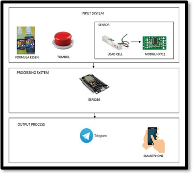
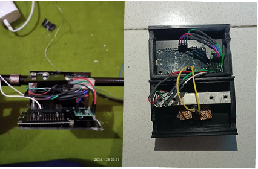
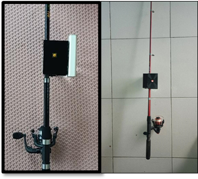

# 🎣 IoT Smart Fishing | Alat Pancing Pintar  
Sebuah alat pancing berbasis IoT yang mampu mendeteksi gerakan umpan, mengetahui berat ikan yang didapat, dan menghitung estimasi harga ikan.  

## 🚀 Fitur Utama  
✅ Mendeteksi saat ikan memakan umpan  
✅ Mengukur berat ikan menggunakan sensor Load Cell  
✅ Mengonversi berat ke harga ikan otomatis  
✅ Mengirimkan notifikasi ke pengguna melalui Bot Telegram  

## 🛠️ Teknologi yang Digunakan  
- **Hardware:** ESP8266, Sensor Load Cell + HX711  
- **Software:** Arduino, Bot Telegram  
- **Bahasa Pemrograman:** C++ (Arduino)  

## 📌 Cara Kerja  
1. Sensor Load Cell mendeteksi berat ikan saat ditarik  
2. Data dikirim ke ESP8266 untuk diproses  
3. Sistem menghitung harga ikan berdasarkan berat  
4. Hasil dikirim ke pengguna melalui Telegram  

## 📷 Dokumentasi  






## 🔥 Cara Instalasi  
1. Clone repositori ini:  
   ```bash
   git clone https://github.com/USERNAME_KAMU/iot-smart-fishing.git
